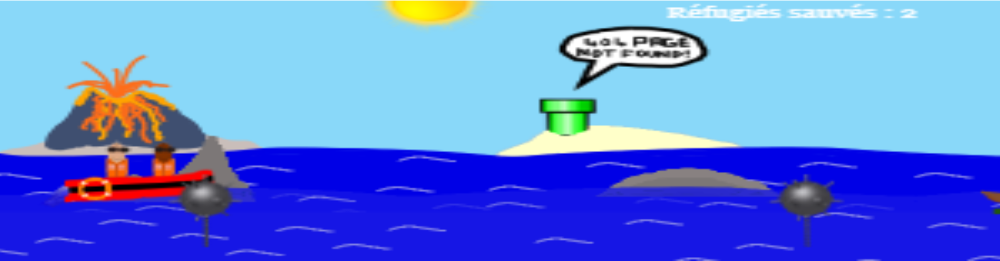

# 404GameNotFound
A small handmade arcade game coded overnight during a CodingNight event. December 2016. Unmodified.

One of the night's challenges was to make an interactive 404 page, there I saw my chance. The entire event was dedicated to improving access to online ressources for migrants... at the time I thought my game was a good idea 

I decided not to edit the code so we can all see what I'm capable of at 4am, after probably a seventh redbull.
Open the files at your own risk, it ain't pretty!

But hey, it kinda works (although you are going to die in about 30sec tops ingame).

I did everything alone (not that there is anything to be proud of here), minus one or two images and some help with the wind blowing effect. Between 1am and 9am, with some hearthstone gameplay somewhere in there (Mean Streets of Gadgetzan was launched during the night !).

You can test it here : <a href="http://cubes.poleno.fr" alt="The demo url">404 Game not found</a>
